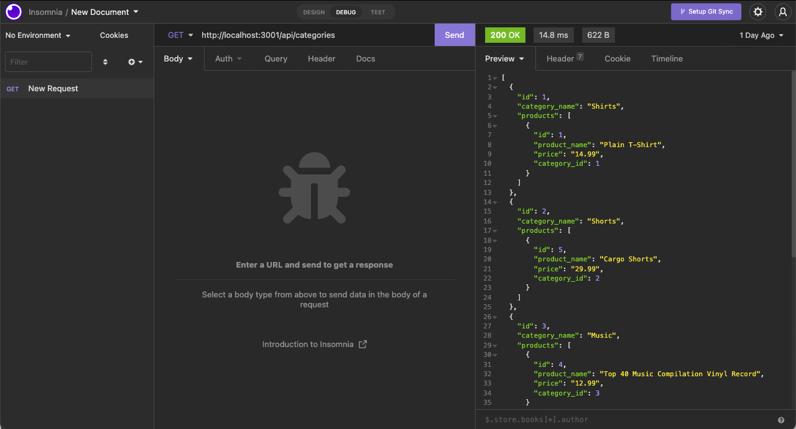

# E-Commerce Back End

## Description
This is a basic e-commerce back end utilizing MySQL2, Sequelize, and .env to run a server and database. This database can be accessed via Insomnia and the user can look up items by category, product, and tag and can do this either individually or for the entire group. The user should also be able to add and delete via Insomnia as well.

## Screenshot

## Links

- Repo: https://github.com/JimMason564/E-CommerceBackEnd
- Walkthrough video: https://drive.google.com/file/d/1gHLAoGzrMzdyGNysDKIngNPOu9cSTg7G/view
